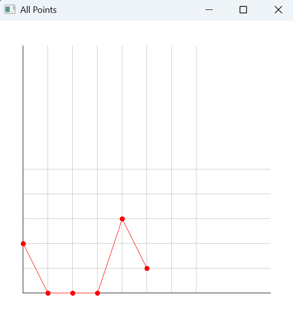
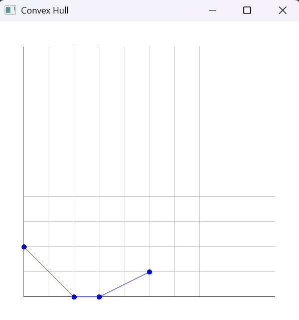
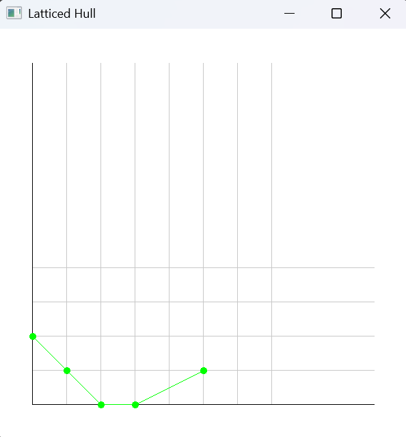

# Newton Polygonizer

The **Newton Polygonizer** is an automation tool that constructs and calculates Newton Polygons from a user-inputted single-variable polynomial of any degree and a target prime. It outputs the results of the calculated Newton Polygon in the terminal and generates points of the corresponding plots.

*Windows special: * With SFML support, graphs can be created and drawn in new windows.

---

## Quick Download (Recommended)

For casual users, this only downloads an executable app for easy access, suited to your OS. This format removes the tedium of extra installations, configurations, or compilations.

***Important Note:*** For some systems with auto-protection or malware scanners, the executable may be flagged as unknown. For users to continue, simply bypass (ex. clicking "Run Anyway"). The source code is all in this repository and I assure all that this project has no harmful intentions.

[](https://github.com/hgd-dev/Newton-Polygonizer/releases/latest/download/Newton-Polygonizer-Windows.zip)
[](https://github.com/hgd-dev/Newton-Polygonizer/releases/latest/download/Newton-Polygonizer-macOS.zip)
[](https://github.com/hgd-dev/Newton-Polygonizer/releases/latest/download/Newton-Polygonizer-Linux.tar.gz)

---

### SFML Version (supported for Windows)

SFML for this project currently only has Windows support. It generates graph plots in new windows to visualize the Newton Polygon.

[](https://github.com/hgd-dev/Newton-Polygonizer/releases/v1.0.0-Windows/download/Newton-Polygonizer-Windows.zip)

***Caveat for SFML runs:*** To ensure lifespan of graph plot windows, the source code always ends in an empty indefinite loop. To terminate the process, use `Ctrl + C` or `Cmd + C` to trigger a keyboard interrupt. Only then does the program end (also automatically closes plot windows).

---

## Project Structure

```
newton-polygon/
├── examples/
│   ├── all_points.png
│   ├── convex_hull.png
│   └── latticed_hull.png
├── src/ # Source files for multi-file project
│ ├── config.cpp
│ ├── geometry.cpp
│ ├── graphics.cpp
│ ├── main.cpp
│ ├── polynomial.cpp
│ └── utility.cpp
├── include/ # Header files for multi-file project
│ ├── config.h
│ ├── geometry.h
│ ├── graphics.h
│ ├── polynomial.h
│ └── utility.h
├── .github/ # GitHub Actions workflows
│ └── workflows/
│ └── build.yml
├── CMakeLists.txt # Build configuration for CMake
├── download.html # Auto-detect download page
└── newton_polygonizer.cpp # Single-file version of the project
```

---

## Features

- Constructs Newton Polygons from user-inputted single-variable polynomials of any degree.  
- Outputs polygon results and step-by-step lattice point calculations in the terminal.  
- Generates interactive SFML plots in separate windows: all points, convex hull, and latticed hull.  
- Cross-platform support: Windows, macOS, Linux.  
- Includes both multi-file CMake project and a single-file `newton_polygonizer.cpp` version.  

---

## Build and Run Instructions (From project source code)

### **Requirements**

| Component                       | Version / Notes                          |
|---------------------------------|-----------------------------------------|
| C++ Compiler                     | C++17 compatible                         |
| CMake                            | 3.10+                                    |
| SFML                             | 2.5+ (graphics, window, system modules) |
| Thread Support                   | Required for multi-window SFML plotting |
| Operating System                 | Windows, macOS, Linux                    |

---

### **1. Multi-file Project (CMake)**

**Build:**

```bash
git clone https://github.com/hgd5363-dev/Newton-Polygonizer.git
cd Newton-Polygonizer

mkdir build && cd build
cmake ..
make
```

**Run:**

```
./NewtonPolygon
```

### **2. Single-file Version (newton_polygonizer.cpp)**

**Compile:**

```bash
# Linux/macOS
g++ -std=c++17 newton_polygonizer.cpp -o NewtonPolygonizer -lsfml-graphics -lsfml-window -lsfml-system -pthread

# Windows (MinGW example)
g++ -std=c++17 newton_polygonizer.cpp -o NewtonPolygonizer.exe -lsfml-graphics -lsfml-window -lsfml-system -pthread
```

**Run:**

```bash
./NewtonPolygonizer   # or NewtonPolygonizer.exe on Windows
```

## Sample run:

**Input Polynomial and Prime:**

```
p = 2
f(x) = 4x^5 - 3x^3 + x^2 - 8x + 6
```

**Terminal output:**

```
All Points:
(0, 1)
(1, 0)
(2, 2)
(3, 0)
(4, 1)

Convex Hull:
(0, 1)
(1, 0)
(3, 0)
(4, 1)

Latticed Hull:
(0, 1)
(1, 0)
(2, 0)
(3, 0)
(4, 1)

Newton Polygon result numbers:
1 2 1 1
```

**SFML Plots:**

**All Points Plot**  


**Convex Hull Plot**  


**Latticed Hull Plot**  


**Explanation:**

- All Points: Calculated nu-values for each coefficient.

- Convex Hull: Lower boundary of the Newton Polygon.

- Latticed Hull: Convex Hull plus lattice points in between.


- Result Numbers: Differences in x-coordinates between consecutive points in the latticed hull.


